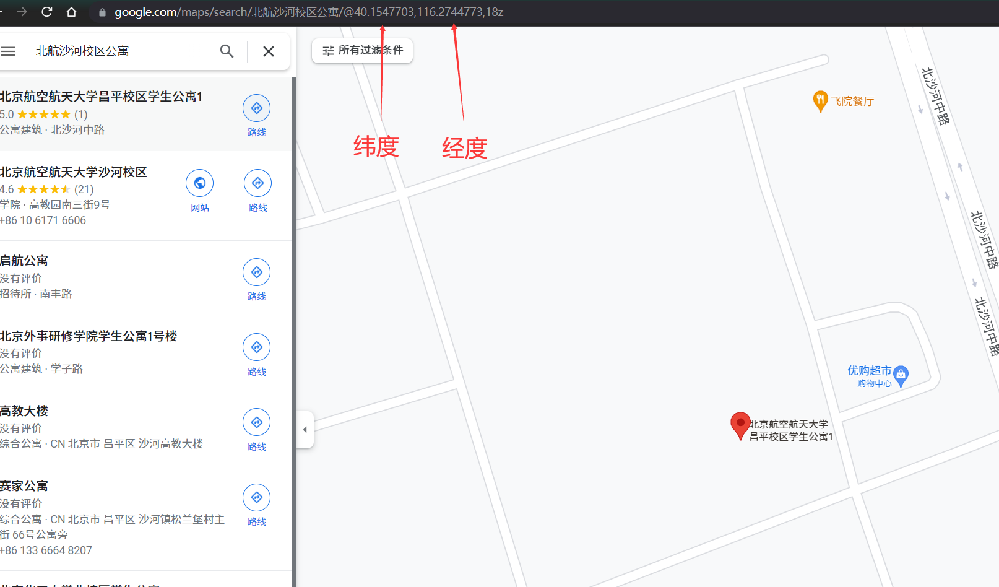
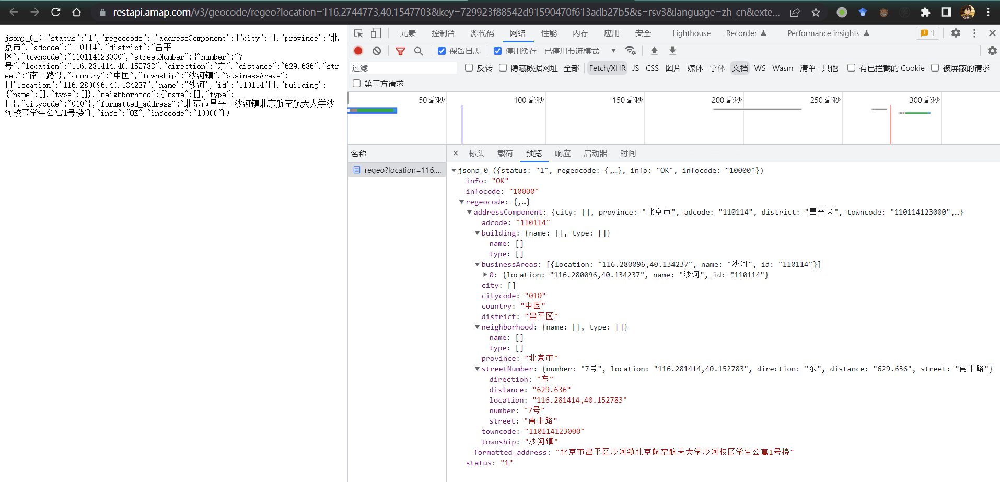

# 支持多线程的北航每日打卡脚本

## 运行环境

### 1、需要python3(建议用python3.8)和requests库

### 2、安装requests库

```# pip install requests```

## 修改配置文件

1、在```user_info.txt```文件中填入学号和密码，可填入多名学生的信息，若需要微信推送，第三列(可选)需要填入server酱的SendKey（见官网 [https://sct.ftqq.com/](https://sct.ftqq.com/)）；

2、地理信息保存在```data.py```的```geo_api_info```中，默认使用了校园路校区的地理位置；

3、如果要把位置改成沙河校区，在```data.py```中把```geo_api_info```注释，再把下面沙河校区的```geo_api_info```解除注释。

## 运行

```main.py```中设置每日17点执行打卡任务，也可以在```mian.py```中将17改成其他时间

1、Windows运行（不可关闭程序）

```# python main.py```

2、Linux系统后台运行

```# nohup python -u main.py > log.txt 2>&1 &```

## 自定义打卡位置

不知道能不能设置在家打卡，假期的时候试试

1、在Goog Map中搜索对应位置，得到相应的经纬度信息


2、使用这个URL：[https://restapi.amap.com/v3/geocode/regeo?location=116.2744773,40.1547703&key=729923f88542d91590470f613adb27b5&s=rsv3&language=zh_cn&extensions=base&callback=jsonp_0_&platform=JS&logversion=2.0&appname=https%3A%2F%2Fapp.buaa.edu.cn%2Fsite%2FbuaaStudentNcov%2Findex&csid=B9E00096-B762-4063-A7D4-19DF9957EE2B&sdkversion=1.4.20](https://restapi.amap.com/v3/geocode/regeo?location=116.2744773,40.1547703&key=729923f88542d91590470f613adb27b5&s=rsv3&language=zh_cn&extensions=base&callback=jsonp_0_&platform=JS&logversion=2.0&appname=https%3A%2F%2Fapp.buaa.edu.cn%2Fsite%2FbuaaStudentNcov%2Findex&csid=B9E00096-B762-4063-A7D4-19DF9957EE2B&sdkversion=1.4.20)

把URL里的第一个参数location改成目标位置的经度和纬度，就可以得到如下图所示的json结果


3、根据得到的结果修改```data.py```里```geo_api_info```的相关数据

注意：1、```geo_api_info```里的```Q```和```R```分别填的是纬度和精度（不知道为什么要有这两个参数）；2、如果json里需要填的key对应的value是```[]```，直接在```data.py```里填空字符串就行。
